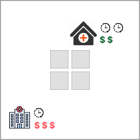
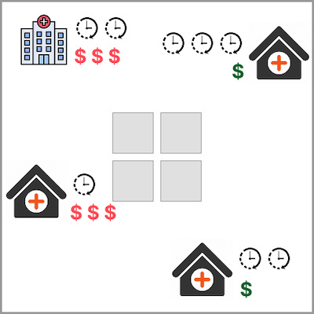

# Maternal Care Access Deprivation

Maternal care access deprivation dataset is a dataset that depicts how difficult is for women in slums and other deprived areas to **access emergency maternal care**. **Mortality** among pregnant women and newborns strongly affects vulnerable communities and has been **prioritised by the communities** participating in the IDEAMAPS project. The team considered community priorities and analysed the different phases of maternity: antenatal, intrapartum or delivery, and postnatal, then decided to **focus on intrapartum or delivery phase as being the most critical**. The intertwined relationship between maternal health care and urban deprivation has been documented and described in the literature [(Abascal et al., 2022)](https://doi.org/10.1016/j.compenvurbsys.2022.101770). Therefore, analysing such conditions implies gathering data and analysing how vulnerable communities relate to emergency maternal care (EmOC) in the cities of Kano and Lagos in Nigeria. To do so, the team built a model that stands on factors such as offer, demmand and access. 

<aside>
💡 This page will help you understand more about how the classifications of Low - Medium - High are assessed in our data model.
</aside>

## Definitions of Deprivation Levels

The dataset relates the offer of emergency obstetric care (i.e., health care facilities offering EmOC), their service levels (i.e., comprehensive or basic care) and relative costs (i.e., private facilities charging higher relative costs that public facilities); the demmand represented as female population in childbearing age; and the phisical accesibility represented in travel time (i.e., travel times that also include delays of waiting for a vehicle, high traffic and difficult road conditions). Together, these values serve to estimate deprivation access based on the two-step floating catchment area (i.e., access deprivation as the inverse of accessibility)  —> **Low, Medium, or High.**

Below, we give definitions of the maternal care access deprivation.

### Low
<blockquote > It is difficult to find adequate maternal care in my neighbourhood, especially during an emergency. Women definitely require a long trip (i.e., more than 30min by car) to reach a suitable and affordable facility offering obstetric care.</blockquote>

### Medium
<blockquote> There are a couple of places offering maternal care in my neighbourhood, some of which can handle emergencies. Women face a mixed scenario with some options to access suitable and affordable obstetric care, and others requiring either to travel long distances, pay relatively high fees or have private insurance to access the required obstetric care. </blockquote>

### High
<blockquote > My neighbourhood offers a wide range of places to provide maternal care and handle obstetric emergencies. The places are nearby with a good mix of public and affordable options as well as private and more expensive ones for those who prefer them. </blockquote>

💡 Together, the accessibility of roads from buildings and road surface types (paved/unpaved) form the different levels of road access deprivation that you see reflected in the grid cells on our map. 

To learn more about how you can help improve the accuracy of these classifications, visit our page on [How to Validate Our Data](/docs/using-the-map/how-to-validate-our-data).

## Additional Insights into Modelling Emergency Maternal Care Access Deprivation

This section provides additional information on the definition of road accessibility.

## Data used for Modelling

