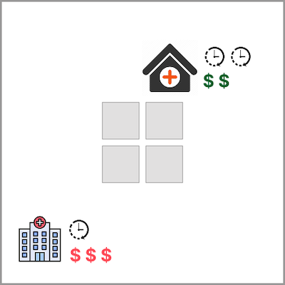
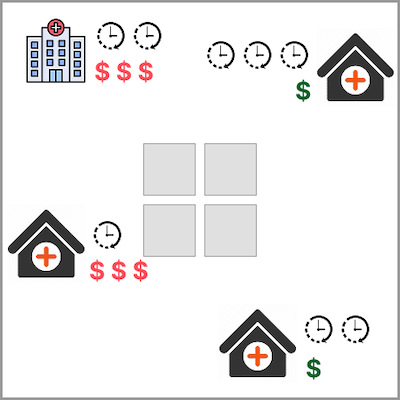
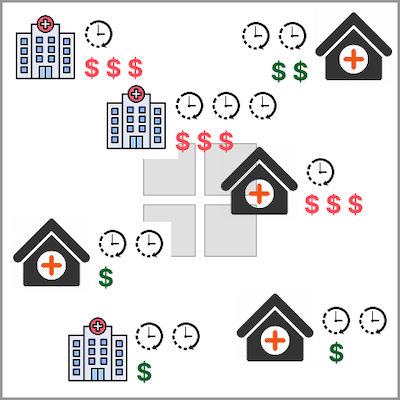
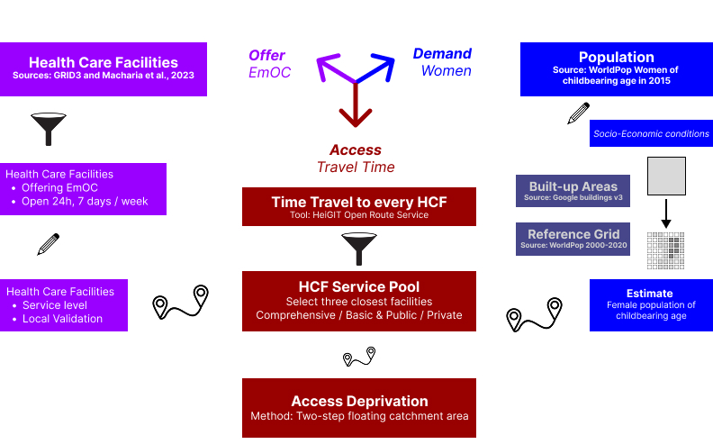
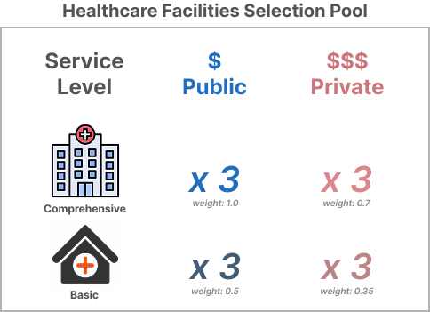

# Emergency Maternal Care Access Deprivation

Maternal care access deprivation dataset is a dataset that depicts how difficult is for women in slums and other deprived areas to **access emergency maternal care**. **Mortality** among pregnant women and newborns strongly affects vulnerable communities and has been **prioritised by the communities** participating in the IDEAMAPS project. The team considered community priorities and analysed the different phases of maternity: antenatal, intrapartum or delivery, and postnatal, then decided to **focus on intrapartum or delivery phase as being the most critical**. The intertwined relationship between maternal health care and urban deprivation has been documented and described in the literature [(Abascal et al., 2022)](https://doi.org/10.1016/j.compenvurbsys.2022.101770). Therefore, analysing such conditions implies gathering data and analysing how vulnerable communities relate to emergency maternal care (EmOC) in the cities of Kano and Lagos in Nigeria. To do so, the team built a model that stands on factors such as offer, demmand and access. 

<aside>
💡 This page will help you understand more about how the classifications of Low - Medium - High are assessed in our data model.
</aside>

## Definitions of Deprivation Levels

The dataset relates the offer of emergency obstetric care (i.e., health care facilities offering EmOC), their service levels (i.e., comprehensive or basic care) and relative costs (i.e., private facilities charging higher relative costs that public facilities); the demmand represented as female population in childbearing age; and the phisical accesibility represented in travel time (i.e., travel times that also include delays of waiting for a vehicle, high traffic and difficult road conditions). Together, these values serve to estimate deprivation access based on the two-step floating catchment area (i.e., access deprivation as the inverse of accessibility)  —> **Low, Medium, or High.**

Below, we give definitions of the maternal care access deprivation.

### Low
<blockquote > My neighbourhood offers a wide range of places to provide maternal care and handle obstetric emergencies. The places are nearby with a good mix of public and affordable options as well as private and more expensive ones for those who prefer them. </blockquote>

### Medium
<blockquote> There are a couple of places offering maternal care in my neighbourhood, some of which can handle emergencies. Women face a mixed scenario with some options to access suitable and affordable obstetric care, and others requiring either to travel long distances, pay relatively high fees or have private insurance to access the required obstetric care. </blockquote>

### High
<blockquote > It is difficult to find adequate maternal care in my neighbourhood, especially during an emergency. Women definitely require a long trip (i.e., more than 30min by car) to reach a suitable and affordable facility offering obstetric care.</blockquote>

To learn more about how you can help improve the accuracy of these classifications, visit our page on [How to Validate Our Data](/docs/using-the-map/how-to-validate-our-data).

## Additional Insights into Modelling Emergency Maternal Care Access Deprivation

<aside>
💡 This section provides additional information on the definition of emergency maternal health access deprivation.
</aside>

The analysis is set as two parallel workstreams (i.e., offer and demand) that merge using a synthetic index to represent access deprivation. Stream one considers health care facilities offering emergency obstetric care (EmOC), their relative costs and a local validation from the local partners in Kano. Stream two considers population counts of the female population of childbearing age and estimates its distribution based on built-up areas within the reference grid. Finally, the accessibility indicator is the result of applying the two-step floating catchment area method based on a pool of nearby health care facilities.

For the first stream, we use information about EmOC offer in terms of capacity and preferences during the maternal emergency time. The team analysed two datasets produced by GRID3 and Macharia et al., 2023 to identify where emergency obstetric care is provided 24 hours a day, 7 days a week. This is considered an initial indicator of capacity for the accessibility estimate. To improve it, the team considers complementary factors such as property (e.g., public and private) and service level (e.g., basic and comprehensive) to assign weights. The capacity/preference weights are set as public facilities preferred due to their relatively lower costs, and comprehensive services preferred over basic ones at the time of an emergency. 

For the second stream, we used population counts from WorldPop: women of childbearing age in 2015 and the reference grid from the general population count. and the open buildings V3 provided by Google. The team analysed various socio-economic conditions that communities highlighted during the participatory-action research sessions carried out with them. Unfortunately, none of them were adequately represented in the available datasets; only elements of income and employment were integrated in the first stream as relative weights. To fit the values of women of childbearing age, aggregated by 1km by 1km grid cells, the team used the number of buildings in the corresponding grid cells as the weighting factor to spread the values. Through that process, the team generated an estimate of the number of women of childbearing age. 

For the second stream, we used population counts from WorldPop: women of childbearing age in 2015 and the reference grid from the general population count. and the open buildings V3 provided by Google. The team analysed various socio-economic conditions that communities highlighted during the participatory-action research sessions carried out with them. Unfortunately, none of them were adequately represented in the available datasets; only elements of income and employment were integrated in the first stream as relative weights. To fit the values of women of childbearing age, aggregated by 1km by 1km grid cells, the team used the number of buildings in the corresponding grid cells as the weighting factor to spread the values. Through that process, the team generated an estimate of the number of women of childbearing age. 

The two streams were combined in two steps. First, we estimated how long it takes to travel from each spot on a grid (100m by 100m) to every health care facility. Based on these travel times, we linked each grid cell to the three nearest health care facilities that offer different levels of services (like public-comprehensive, public-basic, private-comprehensive, and private-public). Next, we used these links to create a synthetic index using the two-step floating catchment area (2SFCA) method, which connects the availability of services (like emergency obstetric care) with the population that needs them.

Once we calculated the synthetic index, we normalized the values to range from 0 to 1, where 0 means high access deprivation (hard to reach health care) and 1 means low access deprivation (easy access). To prepare the data for visualisation, we removed grid cells with no population and then sorted the remaining values into three categories with roughly the same number of grid cells in each.

For a full technical documentation of the model, the team is working on a [detailed publication]().

## Limitations and assumptions

As with any model, there are limitations that emerge from the multiple decisions made and constraints imposed by the available datasets. The following are the main limitations identified by the team. 

- Population counts might not reflect the most recent changes in demographics or how people are spread out in different areas.

- The health care facilities we have chosen might not cover all available options, meaning some places that offer emergency obstetric care (EmOC) might be overlooked, while others that do not provide it currently might be included.

- To estimate travel times, we used a standard routing service where the vehicle speeds were not tested on the ground, which can lead to inaccuracies.

- There are some roads that are not captured in the dataset used to calculate routes and travel times.

- We did not consider public transport to estimate travel times. 

- Using synthetic indexes adds complexity, making it hard to explain the process and difficult to provide feedback on the results.

## Focus area for validation

The focus areas are those in the transitions between the access deprivation classes defined by the IDEAMAPS team.

## Data used for Modelling

The model relies on the following datasets:
- [Health care facilities compiled by GRID3](https://grid3.org/publications/mapping-health-facilities)
- [Women of childbearing age population counts from WorldPop](https://hub.worldpop.org/geodata/summary?id=18447)
- [General population counts from WorldPop](https://hub.worldpop.org/geodata/summary?id=49705)
- [Open buildings V3 from Google](https://developers.google.com/earth-engine/datasets/catalog/GOOGLE_Research_open-buildings_v3_polygons)
- [Road network data from OpenStreetMap via the Open Route Service API](https://openrouteservice.org/)

## Appendix: Two-Step Floating Catchment Area (2SFCA) Method

The two-step floating catchment area (2SFCA) method is used to calculate accessibility. The formula for $R_j$, which represents the accessibility score for a location $j$, is as follows:

$$
R_j = \sum_{i \in \{d_{ij} \leq d_0\}} \frac{S_i}{\sum_{k \in \{d_{ik} \leq d_0\}} P_k}
$$

Where:
- $R_j$: Accessibility score for location $j$.
- $S_i$: Supply (e.g., capacity of healthcare facilities) at location $i$.
- $P_k$: Population demand at location $k$.
- $d_{ij}$: Distance between location $i$ and $j$.
- $d_0$: Threshold distance within which accessibility is considered.
- $\sum_{i \in \{d_{ij} \leq d_0\}}$: Summation over all supply locations $i$ within the threshold distance $d_0$ from $j$.
- $\sum_{k \in \{d_{ik} \leq d_0\}}$: Summation over all demand locations $k$ within the threshold distance $d_0$ from $i$.

This formula combines supply and demand within a defined catchment area to estimate accessibility.
