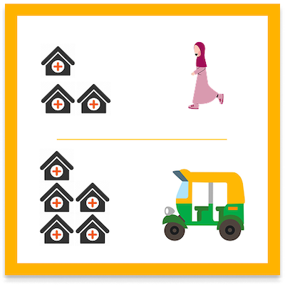
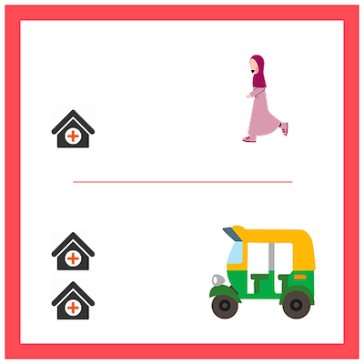

# General Healthcare Access Deprivation

Limited access to primary health negatively impacts the Nigerian population, especially on issues like infant and maternal mortality Rates [(Ogah, P., Uguru, N., Okeke, C. et al., 2024)](https://doi.org/10.1186/s12913-024-11406-0). Also, it has consequences on the way preventable diseases spread and increased healthcare costs, making it impactful for livelihoods in general and socio economic development in the country. With 190 million Nigerians struggling to access health care [(WHO, 2024)](https://www.who.int/about/accountability/results/who-results-report-2024-2025), the understanding of such deprivation becomes crucial, especially in slums and other deprived areas.

<aside>
💡 This page will help you understand more about how the classifications of Low - Medium - High are assessed in our data model.
</aside>

 
This model shows how people living in slums and other deprived areas have trouble getting basic healthcare. Because of the many negative effects of not having proper healthcare, the communities have decided that this is a key topic for them to work on together in the IDEAMAPS project. The model focuses on two main factors: the availability of healthcare services and how easy it is to access them.
Healthcare availability refers to the options community members have for conveniently receiving basic healthcare. Ideally, healthcare facilities should provide services at very low costs so that serious illnesses can be detected early and common issues can be treated on time.
Healthcare accessibility looks at the time and resources needed to choose and get to a healthcare facility. When there are many facilities to choose from, it reduces the chances of not being seen by a professional due to a lack of space or full agendas. Ideally, having access to various (five or more) facilities makes it easier to receive timely care. If walking to a facility is not an option, being able to get there by vehicle should not require a long trip (no more than 30 minutes); longer trips mean higher costs and complicated transfers between different transport systems. With these points in mind, the team examined the following two factors.

1. Healthcare Offer: The offer is represented by public and primary healthcare facilities registered in different databases. The local IDEAMAPS team in Kenya and Nigeria complemented the dataset with their knowledge about ownership and service levels. For expansion cities, the IDEAMAPS team carried out ad-hoc classification of healthcare facilities. This is only indicative of local conditions, but requires local validation. Detailed documentation of data sources and compilation procedures can be found in the city-specific README files or Jupyter notebooks (ipynb). General healthcare in slums and deprived areas is usually linked to public facilities, which usually offer low costs for arriving and receiving care.

2. Healthcare Accessibility: The team considered travel times by walking and by vehicle to estimate physical accessibility [(ORS, 2025; Florio et al., 2023)](https://doi.org/10.1016/j.apgeog.2023.103118). The team estimated travel times for each gridcell in the study areas and counted the number accessible of health facilities. With counts of cero or one health facilities, the areas were labeled as being in high access deprivation. Medium or high labels were assigned when counts increased.

## Definitions of Deprivation Levels

This dataset relates to the general healthcare services offered by public facilities and the conditions in which communities can choose and access them. In every city, counts of the healthcare facilities that can be reached by walking or by short trips by vehicle were used to estimate the three deprivation levels as —>  **Low, Medium, or High.**

### Low
<blockquote> My neighbourhood has multiple options for accessing primary healthcare. There are enough public facilities to choose from within walking distance, or if using a vehicle. </blockquote>

### Medium
<blockquote> There are some options to access primary healthcare in my neighbourhood. A few facilities are accessible on foot, but it is better to consider using a vehicle to have alternatives.</blockquote>

### High
<blockquote> My neighbourhood has limited options for accessing primary healthcare. There is only few or no public healthcare facility nearby. Therefore, a vehicle is required to access public facilities.</blockquote>

## City-Specific thresholds for general healthcare access deprivation

Thresholds for primary healthcare accessibility differ across cities due to variations in urban scale, spatial distribution of facilities, population density and local mobility conditions. Thresholds also adapt to based on the quality of the available datasets. The deprivation levels defined above should be interpreted relative to each city’s context. The table below summarises the thresholds applied in each city for classification.

- ### Kano, Nigeria

[Functional Urban Area (FUA)](https://human-settlement.emergency.copernicus.eu/): ~ 1409 km², FUA population: approximately 4,821,779 (2015)

| Deprivation level | Walking access (1 km)                  | Vehicle access (3.3 km)       |
|-------------------|----------------------------------------|-------------------------------|
| High (2)          | 1 or fewer facilities                  | not used for classification   |
| Medium (1)        | less than 4 facilities                 | or less than 15 facilities    |
| Low (0)           | 4 or more facilities                   | and 15 or more facilities     |

- ### Lagos, Nigeria

[Functional Urban Area (FUA)](https://human-settlement.emergency.copernicus.eu/): ~ 2284 km², FUA population: approximately 12,337,227 (2015)

| Deprivation level | Walking access (1 km)                  | Vehicle access (3.3 km)       |
|-------------------|----------------------------------------|-------------------------------|
| High (2)          | 1 or fewer facilities                  | not used for classification   |
| Medium (1)        | less than 4 facilities                 | or less than 15 facilities    |
| Low (0)           | 4 or more facilities                   | and 15 or more facilities     |

- ### Nairobi, Kenya

[Functional Urban Area (FUA)](https://human-settlement.emergency.copernicus.eu/): ~ 859 km², FUA population: approximately 4,712,494 (2015)

| Deprivation level | Walking access (1 km)                  | Vehicle access (3.3 km)       |
|-------------------|----------------------------------------|-------------------------------|
| High (2)          | no facilities                          | 1 or fewer facilities         |
| Medium (1)        | fewer than 2 facilities                | and fewer than 4 facilities   |
| Low (0)           | 2 or more facilities                   | or 4 or more facilities       |

### **Expansion Cities**

- ### Accra, Ghana

[Functional Urban Area (FUA)](https://human-settlement.emergency.copernicus.eu/): ~ 1934 km², FUA population: approximately 4,786,265 (2015)

| Deprivation level | Walking access (1 km)                  | Vehicle access (3.3 km)       |
|-------------------|----------------------------------------|-------------------------------|
| High (2)          | no facilities                          | no facilities                 |
| Medium (1)        | fewer than 1 facility                  | and fewer than 3 facilities   |
| Low (0)           | at least 1 facility                    | or at least 3 facilities      |

- ### Harare, Zimbabwe

[Functional Urban Area (FUA)](https://human-settlement.emergency.copernicus.eu/): ~ 1521 km², FUA population: approximately 2906,612 (2015)

| Deprivation level | Walking access (1 km)                  | Vehicle access (3.3 km)       |
|-------------------|----------------------------------------|-------------------------------|
| High (2)          | no facilities                          | no facilities                 |
| Medium (1)        | fewer than 1 facility                  | and no more than 3 facilities |
| Low (0)           | at least 1 facility                    | or more than 3 facilities     |

- ### Abuja, Nigeria

[Functional Urban Area (FUA)](https://human-settlement.emergency.copernicus.eu/): ~ 1027 km², FUA population: approximately 2,578,150 (2015)

| Deprivation level | Walking access (1 km)                  | Vehicle access (3.3 km)       |
|-------------------|----------------------------------------|-------------------------------|
| High (2)          | no facilities                          | no more than 2 facilities     |
| Medium (1)        | fewer than 2 facilities                | and no more than 8 facilities |
| Low (0)           | 2 or more facilities                   | or more than 8 facilities     |

- ### Pereira, Colombia

[Functional Urban Area (FUA)](https://human-settlement.emergency.copernicus.eu/): ~ 138 km², FUA population: approximately 641,965 (2015)

| Deprivation level | Walking access (1 km)                  | Vehicle access (3.3 km)       |
|-------------------|----------------------------------------|-------------------------------|
| High (2)          | no facilities                          | no facilities                 |
| Medium (1)        | fewer than 1 facility                  | up to 14 facilities           |
| Low (0)           | at least 1 facility                    | or more than 14 facilities    |

- ### Kisumu, Kenya

[Functional Urban Area (FUA)](https://human-settlement.emergency.copernicus.eu/): ~ 134 km², FUA population: approximately 369,934 (2015)

| Deprivation level | Walking access (1 km)                  | Vehicle access (3.3 km)       |
|-------------------|----------------------------------------|-------------------------------|
| High (2)          | no facilities                          | no more than 2 facilities     |
| Medium (1)        | fewer than 2 facilities                | and no more than 8 facilities |
| Low (0)           | 2 or more facilities                   | or more than 8 facilities     |

- ### Pasto, Colombia

[Functional Urban Area (FUA)](https://human-settlement.emergency.copernicus.eu/): ~ 58 km², FUA population: approximately 416,042 (2015)

| Deprivation level | Walking access (1 km)                  | Vehicle access (3.3 km)       |
|-------------------|----------------------------------------|-------------------------------|
| High (2)          | no facilities                          | fewer than 3 facilities       |
| Medium (1)        | no facilities                          | between 3 and 12 facilities   |
|                   | ***or*** 1 facility                    | fewer than 2 facilities       |
| Low (0)           | no facilities                          | and more than 12 facilities   |
|                   | ***or*** at least 1 facility           | and 2 or more facilities      |
|                   | ***or*** 2 or more facilities          |                               |

- ### Beira, Mozambique

[Functional Urban Area (FUA)](https://human-settlement.emergency.copernicus.eu/): ~ 39 km², FUA population: approximately 340,492 (2015)

| Deprivation level | Walking access (1 km)                  | Vehicle access (3.3 km)       |
|-------------------|----------------------------------------|-------------------------------|
| High (2)          | no facilities                          | no facilities                 |
| Medium (1)        | fewer than 1 facility                  | and fewer than 3 facilities   |
| Low (0)           | at least 1 facility                    | or at least 3 facilities      |

---

  
To learn more about how you can help improve the accuracy of these classifications, visit our page on [How to Validate Our Data](docs/using-the-map/how-to-validate-our-data).

## Limitations and assumptions

As with any model, some limitations emerge from the decisions and constraints imposed by the available datasets. The following are the main limitations identified by the team.

- Population was not considered in the model. Instead, considering that an area should have access to multiple healthcare facilities, aimed at considering the capacity and opening times.
- The healthcare facilities can be outdated, and, in some cases, public ownership cannot be validated.
- To estimate travel times, we used a standard routing service where the walking and vehicle speeds were not tested on the ground, which can lead to inaccuracies.
- Some roads are not captured in the dataset for calculating routes and travel times.
- We did not consider public transport when estimating travel times.
- Using synthetic indexes adds complexity, making explaining the process and providing feedback on the results difficult.

## Focus area for validation

The focus areas are related to the boundaries between the low and medium categories. The counts might overlook the perceived accessibility to healthcare facilities. By validating those areas, the team can adjust and improve the model thresholds used.

## Data used for Modelling

The model relies on the following datasets:

- [General population counts from WorldPop](https://hub.worldpop.org/geodata/summary?id=49705)

- [Road network data from OpenStreetMap via the Open Route Service API](https://openrouteservice.org/)

## Data used for Healthcare facilties in expansion cities

- **Kano**: Based on data from the [GRID3 NGA - Health Facilities v2.0](https://data.grid3.org/datasets/a0ed9627a8b240ff8b315a84575754a4_0/explore) repository, the classification for validation is determined by facility ownership and level.

- **Lagos**: Based on data from the [GRID3 NGA - Health Facilities v2.0](https://data.grid3.org/datasets/a0ed9627a8b240ff8b315a84575754a4_0/explore) repository, the classification for validation is determined by facility ownership and level.

- **Nairobi**: The data were scraped from the [Kenya Master Health Facility Registry (KMHFR)](https://kmhfr.health.go.ke/public/facilities) which is an application with all health facilities and community units in Kenya, supplemented by field validation from the IDEAMAPS local expert team.

- **Accra**: The healthcare facilities data was extracted from [an official government data set of health care facilities for all of Ghana](https://data.gov.gh/dataset/health-facilities) , the classification for facilities is determined by ownership and type.

- **Harare**: Internal dataset produced by the FCDO project [African Cities Research Consortium](https://www.african-cities.org/) in collaboration with the Global Development Institute (GDI) at The [University of Manchester](https://www.gdi.manchester.ac.uk/).

- **Abuja**: Based on data from the [GRID3 NGA - Health Facilities v2.0](https://data.grid3.org/datasets/a0ed9627a8b240ff8b315a84575754a4_0/explore) repository, supplemented by field validation from the IDEAMAPS local expert team.

- **Pereira**: The dataset is derived from the [Special Registry of Health Service Providers and Venues](https://www.datos.gov.co/Salud-y-Protecci-n-Social/Registro-Especial-de-Prestadores-y-Sedes-de-Servic/c36g-9fc2/about_data), supplemented by field validation from the Colombia local expert team. As the dataset provides a complete address for each healthcare facility, geographic coordinates (latitude and longitude) were obtained using the [Google Geocoding API](https://developers.google.com/maps/documentation/geocoding).

- **Kisumu**: The data were scraped from the [Kenya Master Health Facility Registry (KMHFR)](https://kmhfr.health.go.ke/public/facilities) which is an application with all health facilities and community units in Kenya, supplemented by field validation from the IDEAMAPS local expert team.  

- **Pasto**: The dataset is derived from the [Special Registry of Health Service Providers and Venues](https://www.datos.gov.co/Salud-y-Protecci-n-Social/Registro-Especial-de-Prestadores-y-Sedes-de-Servic/c36g-9fc2/about_data), supplemented by field validation from the Colombia local expert team. As the dataset excluding geographic coordinates but provides a complete address for each healthcare facility, geographic coordinates (latitude and longitude) were obtained using the [Google Geocoding API](https://developers.google.com/maps/documentation/geocoding).

- **Beira**: The healthcare facilities data was extracted from the [Spatial database of health facilities managed by the public health sector in sub Saharan Africa](https://doi.org/10.6084/m9.figshare.7725374), which is a geocoded inventory of public health service providers in sub Saharan Africa, facility classifications for Beira are determined by ownership and facility type.
