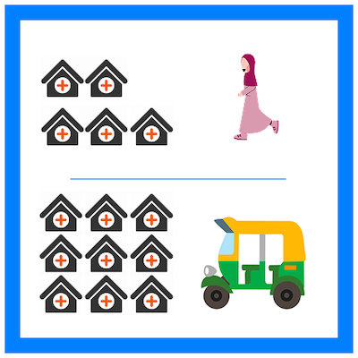
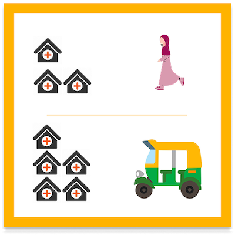
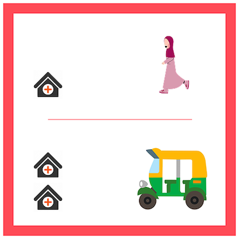

# General Healthcare Access Deprivation

Limited access to primary health negatively impacts the Nigerian population, especially on issues like infant and maternal mortality Rates [(Ogah, P., Uguru, N., Okeke, C. et al., 2024)](https://doi.org/10.1186/s12913-024-11406-0). Also, it has consequences on the way preventable diseases spread and increased healthcare costs, making it impactful for livelihoods in general and socio economic development in the country. With 190 million Nigerians struggling to access health care [(WHO, 2024)](https://www.who.int/about/accountability/results/who-results-report-2024-2025), the understanding of such deprivation becomes crucial, especially in slums and other deprived areas.

<aside>
💡 This page will help you understand more about how the classifications of Low - Medium - High are assessed in our data model.
</aside>

This model shows how people living in slums and other deprived areas have trouble getting basic healthcare. Because of the many negative effects of not having proper healthcare, the communities have decided that this is a key topic for them to work on together in the IDEAMAPS project. The model focuses on two main factors: the availability of healthcare services and how easy it is to access them.
Healthcare availability refers to the options community members have for conveniently receiving basic healthcare. Ideally, healthcare facilities should provide services at very low costs so that serious illnesses can be detected early and common issues can be treated on time. 
Healthcare accessibility looks at the time and resources needed to choose and get to a healthcare facility. When there are many facilities to choose from, it reduces the chances of not being seen by a professional due to a lack of space or full agendas. Ideally, having access to various (five or more) facilities makes it easier to receive timely care. If walking to a facility is not an option, being able to get there by vehicle should not require a long trip (no more than 30 minutes); longer trips mean higher costs and complicated transfers between different transport systems. With these points in mind, the team examined the following two factors. 
1. Healthcare Offer: The offer is represented by the public facilities registered in the latest geospatial database of mapped health facilities [(GRID3, 2023)](https://grid3.org/publications/mapping-health-facilities). In Kano, the local IDEAMAPS team complemented the dataset with their knowledge about ownership and service levels. General health in slums and deprived areas is usually linked to public facilities, which are conveniently located to reduce travel times. This ensures low costs for arriving and receiving care.
2. Healthcare Accessibility: The team considered travel times by walking and by vehicle to estimate physical accessibility [(ORS, 2025; Florio et al., 2023)](https://doi.org/10.1016/j.apgeog.2023.103118). The team estimated travel times for each gridcell in the study areas and counted the number accessible of health facilities. With counts of cero or one health facilities, the areas were labeled as being in high access deprivation. Medium or high labels were assigned when counts increased.

## Definitions of Deprivation Levels

This dataset relates to the general healthcare services offered by public facilities and the conditions in which communities can choose and access them. Counts of the healthcare facilities that can be reached by walking or by short trips by vehicle were used to estimate the three deprivation levels as —> Low, Medium, or High. Below, we give definitions of the general healthcare access deprivation  —> **Low, Medium, or High.**

Below, we give definitions of the maternal care access deprivation.

### Low
<blockquote > My neighbourhood has multiple options for accessing primary healthcare. There are enough (4+) public facilities to choose from within walking distance, or plenty of them (15+) if using a vehicle.</blockquote>

### Medium
<blockquote> There are some options to access primary healthcare in my neighbourhood. A few facilities are accessible on foot (no more than 3), but it is better to consider using a vehicle to have alternatives. </blockquote>

### High
<blockquote > My neighbourhood has minimal options for accessing primary healthcare. At best, there is just one public healthcare facility nearby. Therefore, a vehicle is required to access public facilities. </blockquote>

To learn more about how you can help improve the accuracy of these classifications, visit our page on [How to Validate Our Data](/docs/using-the-map/how-to-validate-our-data).

## Limitations and assumptions

As with any model, some limitations emerge from the decisions and constraints imposed by the available datasets. The following are the main limitations identified by the team. 
- Population was not considered in the model. Instead, considering that an area should have access to multiple healthcare facilities, aimed at considering the capacity and opening times.
- The healthcare facilities can be outdated, and, in some cases, public ownership cannot be validated.
- To estimate travel times, we used a standard routing service where the walking and vehicle speeds were not tested on the ground, which can lead to inaccuracies.
- Some roads are not captured in the dataset for calculating routes and travel times.
- We did not consider public transport when estimating travel times. 
- Using synthetic indexes adds complexity, making explaining the process and providing feedback on the results difficult.

## Focus area for validation

The focus areas are related to the boundaries between the low and medium categories. The counts might overlook the perceived accessibility to healthcare facilities. By validating those areas, the team can adjust and improve the model thresholds used.

## Data used for Modelling

The model relies on the following datasets:
- [Health care facilities compiled by GRID3](https://grid3.org/publications/mapping-health-facilities)

- [General population counts from WorldPop](https://hub.worldpop.org/geodata/summary?id=49705)

- [Road network data from OpenStreetMap via the Open Route Service API](https://openrouteservice.org/)

