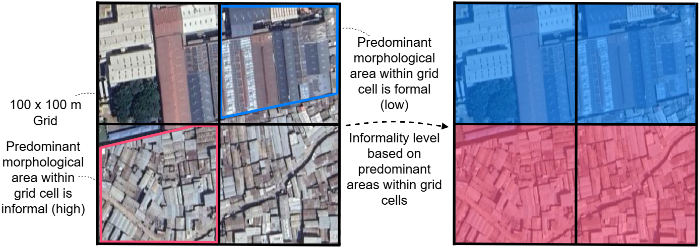

# Morphological Informality (Version 2)

Morphological Informality is a dataset focused on mapping the difference between formally planned and informally planned areas of cities as an indication of urban deprivation. The levels of morphological informality are classified as **Low morphological informality, Medium morphological informality, or High morphological informality**. Generally, higher levels of informality are related to more deprived areas.

<aside>
💡 This page will help you understand more about how the classifications of Low - Medium - High are predicted in our data model.

</aside>

## Definitions of Morphological Informality Levels

The dataset relates the form and arrangement (that is, morphology) of buildings and roads to informality.
Together, these indicators help predict the level of morphological informality —> **Low, Medium, or High.**

Our modellers defined a set of rules based on the morphology of buildings and roads to classify the data into the categories Low, Medium, and High.

Below, we give the adopted definitions of the morphological deprivation levels.

### Low
<blockquote> Buildings are larger, detached from one another, and regularly arranged. It is easy to visualise roads, pathways, or open spaces between them. Areas with no buildings are also categorised as low. </blockquote>

### Medium
<blockquote> Buildings are small and close together (it can be hard to visualise roads, pathways, or spaces between them) OR buildings are irregularly arranged (with varying alignment to neighbouring structures). Roads are moderately present. </blockquote>

### High
<blockquote > Buildings are small and close together AND buildings are irregularly arranged (with varying alignment to neighbouring structures). Roads are hard to visualise or they are absent. </blockquote>

<aside>
💡 Together, the morphology of buildings and roads form the different levels of morphological informality that you see reflected in the grid cells on our map. 

To learn more about how you can help improve the accuracy of these classifications, visit our page on [How to Validate Our Data](/docs/using-the-map/how-to-validate-our-data).
</aside>

## Mixed Grid Cells

Different morphological areas may be present within a single grid cell due to the spatial resolution (100 x 100 m) of the IDEAMAPS grid. In particular, these *mixed* grid cells can appear around the borders of settlements.

For their validation of mixed grid cells, the predominant morphological area within the cell should be considered. In the example below, the lower left and upper right cells contain mixtures of formal and informal morphologies. For the lower left pixel, the largest morphological area within the cell is informal; consequently, the predominant morphological informality level is high. On the other hand, the informal area in the upper right cell is smaller than the formal area; consequently, the predominant morphological informality level is low. 

## Additional Insights Into Modelling Morphological Informality

This section provides additional information on the definition of morphological informality.

### Conceptual model

Our modellers measured morphological informality using two indicators: small, dense structures and irregular settlement layout. The two indicators are combined to three levels of morphological informality according to the following conceptual model: 

### Modelling indicators based on morphological descriptors 

In order to model the two indicators, a morphological approach was used, focusing on the shapes and alignment of buildings and roads. To that end, our modellers defined several numerical descriptors capturing the distinctive morphological characteristics of the indicators. Below you can find a list of morphological descriptors associated with small, dense structures and irregular settlement layout.

**Morphological descriptors associated with small, dense structures**:

| Descriptor         | Explanation                                                                                            |
|--------------------|--------------------------------------------------------------------------------------------------------|
| Building count     | Number of buildings in a grid cell                                                                     |
| Building area      | Total area of a grid cell covered by buildings                                                         |
| Building size      | Typical building size within a grid cell                                                               |
| Area ratio         | Typical relationship between building sizes and the sizes of their surrounding land within a grid cell |
| Neighbour distance | Typical distance between buildings and their neighbouring buildings within a grid cell                 |
| Neighbours count   | Typical number of neighbouring buildings for buildings within a grid cell                              |

**Morphological descriptors associated with an irregular settlement layout**:

| Descriptor              | Explanation                                                 |
|-------------------------|-------------------------------------------------------------|
| Building orientation    | Variation of building orientations within a grid cell       |
| Building-plot alignment | Typical alignment of buildings with their surrounding plots |
| Plot orientation        | Variation of plot orientations within a grid cell           |
| Road orientation        | Variation of road orientations within a grid cell           |
| Building-road alignment | Typical alignment of buildings with their nearest roads     |

* "Typical" means that the median value among the buildings falling withing a grid cell was measured.
* "Variation" means that the disorder among the buildings falling within a grid cell was measured via Shannon's Entropy.

We use a clustering approach to group the grid cells of the city into areas with similar morphological characteristics. These areas are then either 

### Technical documentation

A technical documentation of the morphological informality model will be published soon. In the meantime, we refer to the Version 1 documentation.

## Data used for Modelling

The model relies on two datasets:
- Building footprints data
- Road network data

Both datasets were obtained from [OpenStreetMap](https://www.openstreetmap.org/). 

The satellite and streetview images used as examples for the morphological deprivation levels were obtained from [Google Maps](https://www.google.com/maps) (Google, Maxar Technologies).