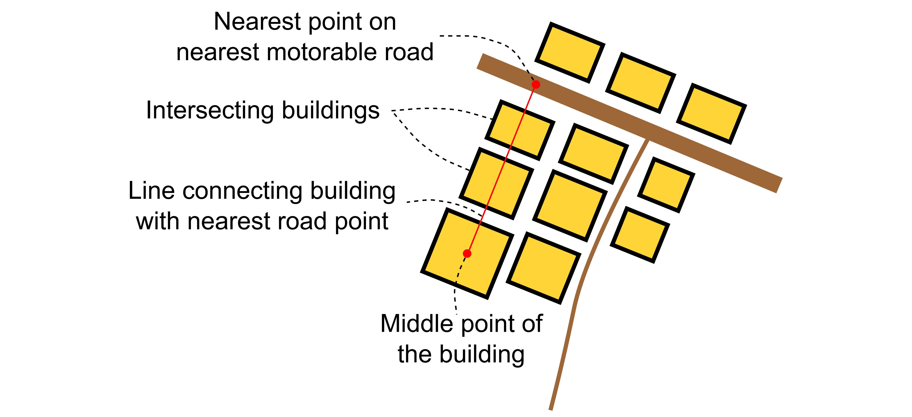
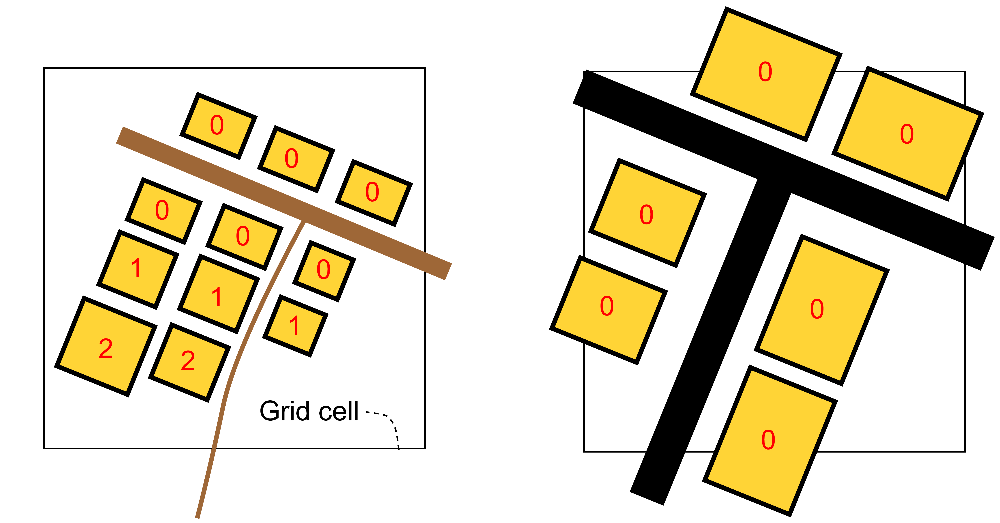

# Road Access Deprivation (Version 1)

Road access deprivation is a dataset focused on mapping how well buildings are connected to roads, also taking into consideration the road surface type (paved/unpaved). The levels of “road access deprivation” are classified as **Low**, **Medium**, or **High**. Generally, higher levels of road access deprivation are related to informal areas.

<aside>
💡 This page will help you understand more about how the classifications of Low - Medium - High are predicted in our data model.
</aside>

## Definitions of Deprivation Levels

The dataset relates the accessibility of roads from buildings and the surface type of roads (paved/unpaved) to informality.
Together, these indicators help predict the level of road access deprivation —> **Low, Medium, or High.**

Below, we give definitions of the road access deprivation levels.

### Low
<blockquote > The road network is paved and in good condition. Most buildings in these areas are directly connected to motorable roads, meaning no buildings block their access to the nearest road. </blockquote>

   

### Medium
<blockquote> Roads are unpaved but motorable. Most buildings are directly connected to roads, meaning no buildings block their access to the road network. </blockquote>

### High
<blockquote > Motorable roads are sparse. Most buildings have only indirect access to the road network via paths, meaning more than one building is generally located between a building and its nearest road. </blockquote>

💡 Together, the accessibility of roads from buildings and road surface types (paved/unpaved) form the different levels of road access deprivation that you see reflected in the grid cells on our map. 

To learn more about how you can help improve the accuracy of these classifications, visit our page on [How to Validate Our Data](/docs/using-the-map/how-to-validate-our-data).

## Additional Insights into Modelling Road Accessibility

This section provides additional information on the definition of road accessibility.

In our model, we measure road accessibility using the number of buildings intersecting lines connecting buildings to their nearest motorable roads.

First, the model determines the nearest point on the nearest motorable road and connects this point to the middle point (i.e., centroid) of the building. Then, the number of buildings intersecting the line between the middle point of the building and the nearest motorable road point is measured (see illustration below).

We compute the number of buildings intersecting the line between a building and its nearest road point for each individual building in a grid cell. We show the resulting values for the buildings in an informal area (left illustration below) and a formal area (right illustration below). Values are expected to be higher in informal areas because many buildings are only connected to motorable roads via footpaths.

In order to aggregate values to our 100 m x 100 m grid, we calculate the average value of this of the buildings located within a grid cell.

If the average number of intersecting buildings for a grid cell exceeds a threshold of 1, the grid cell is associated with high road access deprivation. The threshold is not set to 0 since intersecting buildings can also occur in formal areas.

Otherwise, meaning the average number is below the threshold of 1, the cell is associated with low or medium road access deprivation depending on the road surface type. Grid cells with mostly paved roads are associated with low deprivation and cells where unpaved roads are dominant with medium deprivation.

For a full technical documentation of the model we refer to [this publication]().

## Data used for Modelling

The model relies on three datasets:
- Road network data
- Road surface type data
- Building footprints data

Road network data was obtained from [OpenStreetMap](https://www.openstreetmap.org/), and surface type data for the roads in Nairobi was leveraged from [Zhou et al. (2024)](https://doi.org/10.1038/s41597-024-03158-7). For building footprints, we used data from the [Overture Maps Foundation](https://overturemaps.org/).

The satellite images used as examples for the road access deprivation levels were obtained from [Google Map](https://www.google.com/maps) (Google, Maxar Technologies).

