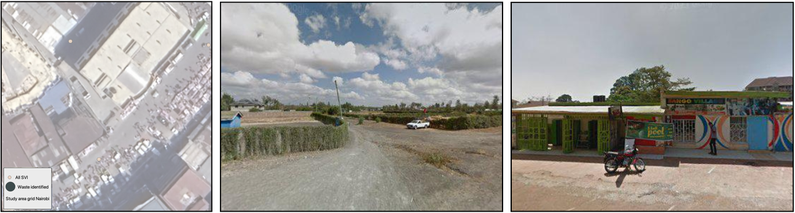
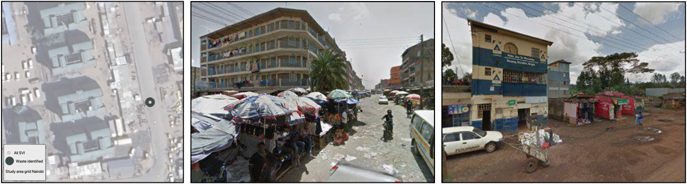

# **Accumulated Waste Piles**

This dataset shows the chance of finding piles of waste in different places. Waste piles can mean that waste collection services are not working well. Areas with more waste piles are often more disadvantaged and may not have regular waste collection.

The dataset groups places into three levels based on how likely you are to find waste piles: Low, Medium, and High. In general, areas with a high chance of waste accumulation may have fewer services and bigger waste problems.

<aside>
💡 This page will help you understand more about how the classifications of Low - Medium - High are predicted in our data model.
</aside>

## **Waste Accumulation Probability Levels:**

### **Low (probability of 0 – 2.4%):**  
<!--- **Unlikely** to see waste piles in this area.  
- But low does not always mean clean—it might also mean **no data** was available for this place.
- **Your feedback** is still very important! If you know there is waste in an area marked as "Low," telling us helps improve the data.
-->

- **What you’ll see**: Rare or no visible waste piles.
- **What it means**:
  - Waste is likely collected regularly, or the area is genuinely clean.
  - **Note**: Low probability could also mean no data—so your observations are incredibly valuable!
- **For communities**: Likely a sign of effective waste management (if the data is accurate).

### **Medium (2.5% – 16.4%):**  
<!--- **Some chance** of seeing waste on the street.  
- Waste may be there, but **not always in large amounts**.  
- This type of waste is more likely to be **temporary**. People may pile waste near the street on purpose so that **waste collection companies can pick it up** for proper management.  
-->

- **What you’ll see**: Occasional waste piles, often temporary (e.g., trash bags waiting for pickup).
- **What it means**:
  - Waste collection is happening but may be delayed or inconsistent.
  - Waste may be intentionally placed for pickup, not necessarily mismanaged.
- **For communities**: Strong indication that structured waste management is urgently needed to improve quality of life. 

### **High (16.4% – 100%):**  
<!--- **Very likely** to see waste piles.  
- This might mean waste is **not collected properly** or people dump waste near the main road.  
- Waste is **often** dumped without proper collection, leading to constant piles that turn into informal dumping sites with **little to no management**.
-->

- **What you’ll see**: Frequent, large-scale waste piles or informal dumps.
- **What it means**:
  - Little to no reliable collection—waste builds up over time.
  - These areas often become long-term dumping sites, posing health and environmental risks.
- **For communities**: Indicates proper waste management should be in place to improve local people's living standards.

### **Summaries Table**
| Level | Probability | Situation Observed | Reality Estimated | Validation | 
|-|-----|----------|----------|----------|
| Low | 0 – 2.4% | - **Unlikely** to see waste piles in this area - May indicate **no data** was available for this location | - No dumping site exists - Domestic waste might be temporarily piled for collection, with regular pickup by authorities | - **No** accumulated waste piles typically observed - **Good, regular waste collection** service and management|
| Medium | 2.5% – 16.4% | - **Some chance** of seeing waste piles on the street - Waste is likely **temporary** | - Waste is collected by services but may experience delays | - **Occasional** waste piles observed - Waste collection exists but **lacks regularity** | 
| High | 16.4% – 100% | - **Very likely** to see waste piles - Piles are often **large** | - Waste accumulates without proper collection -- Persistent piles may become informal dumping sites with minimal/no management | - **Frequent** waste piles observed - **Lacks waste collection service**; minimal to no waste management

> **📌 Note for Reviewers**  
> -"No data" cases include both "no waste" and "no monitoring data". A cell labeled "Low" might still have waste if data is missing—verify critically.  
> - Street view imagery only captures a single moment in time. If the result conflicts with your memory, prioritize your general impression over the modeled result during validation.

--------------

This dataset will help the local community and city planners understand where waste is piling up. The goal is to use this information to improve waste collection services and make the area cleaner and healthier for everyone.

Your contribution is super important for us. Thank you for your time and effort.

